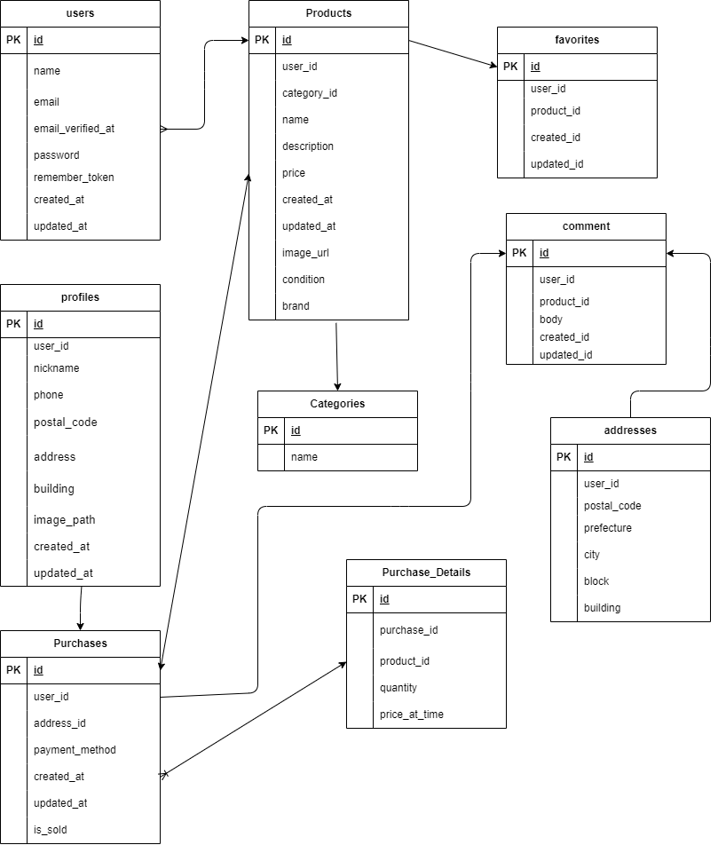

# FreeMarketApp

## 環境構築

### Docker ビルド

1. git clone <https://github.com/yourname/freemarket-app.git>
2. cd freemarket-app
3. docker-compose up -d --build

### Laravel 環境構築

1. `docker-compose exec php bash` でコンテナの PHP に入る
2. `composer install` で必要なパッケージをインストール
3. `.env.example` を `.env` にコピーし、環境変数を設定
4. `php artisan key:generate` でアプリケーションキーを作成
5. `php artisan migrate` で本番用DBにマイグレーション
6. `php artisan db:seed` で本番用DBにデータ投入

### テスト環境構築

1. `.env` をコピーして `.env.testing` を作成（phpunit 用テスト環境の設定）
2. `php artisan migrate --env=testing` でテスト用DBにマイグレーション
3. `php artisan db:seed --env=testing` でテスト用DBにデータ投入

### 開発補助コマンド

1. `php artisan make:test` テストファイル作成
2. `php artisan route:list` ルーティング一覧を表示
3. `php artisan serve`     アプリ起動

## 使用技術（実行環境）

- PHP 7.4.9
- Laravel 8.83.29
- MySQL（MariaDB 10.3.39）
- Docker / Docker Compose
- Stripe（決済API）
- Mailhog（メールテスト）
- phpMyAdmin（DB可視化）

## ER 図

## URL

- 開発環境: [http://localhost](http://localhost)
- phpMyAdmin: [http://localhost:8080](http://localhost:8080)
- Mailhog: <http://localhost:8025>

## 主な機能(機能一覧)

- 商品一覧・詳細表示
- 商品の出品（ログインユーザーのみ）
- 商品の購入（Stripe決済）
- コメント投稿機能
- お気に入り登録機能
- マイページ（購入履歴・お気に入り一覧）
- ユーザー登録 / ログイン / ログアウト（Laravel Fortify）
